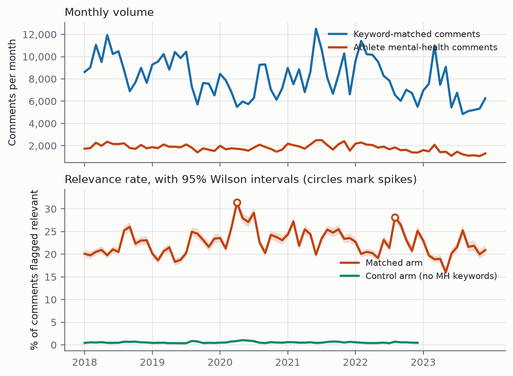
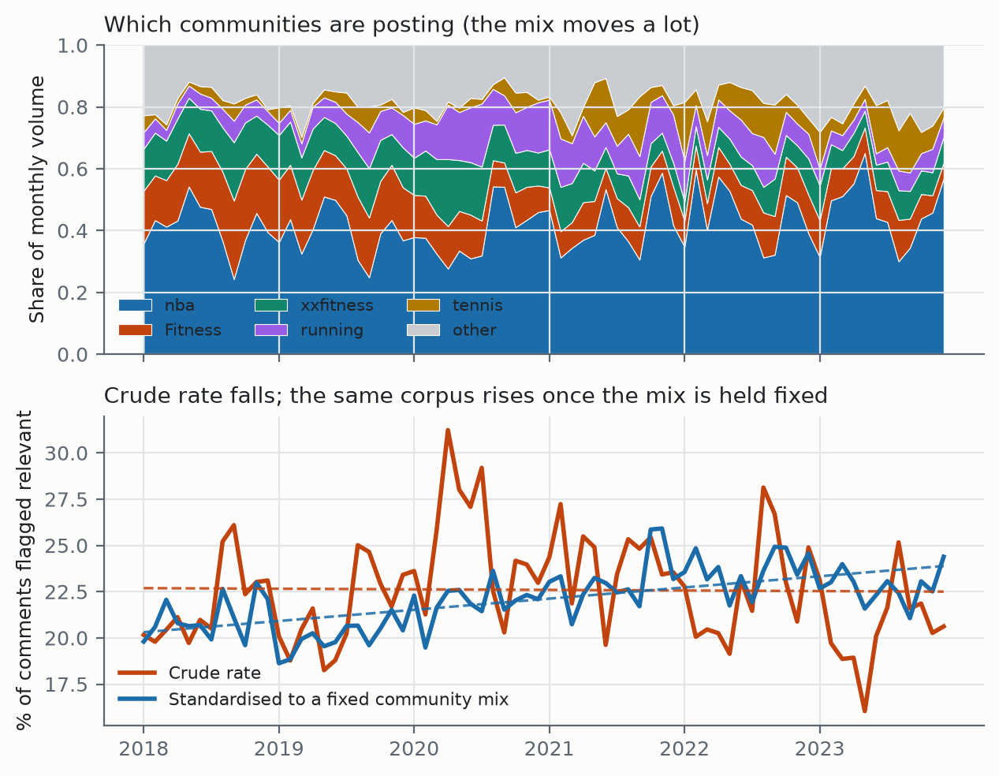
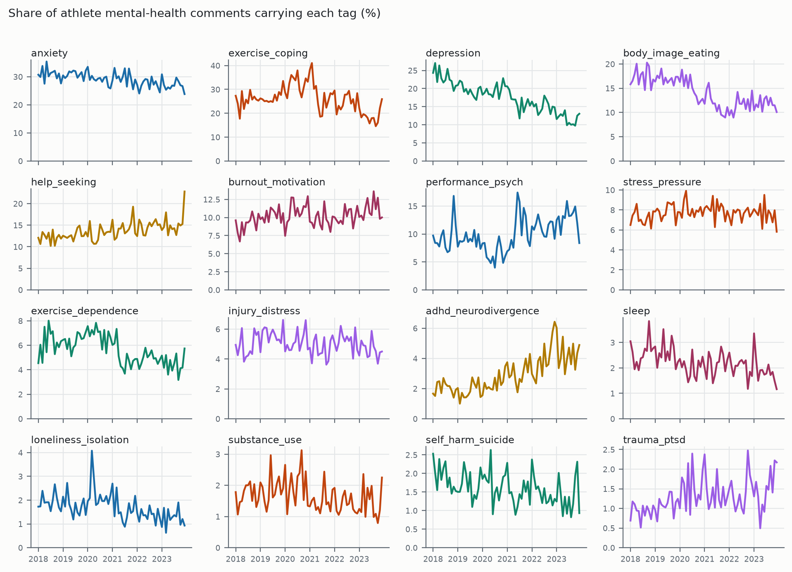

<!-- Mirror of docs/paper/AMHC_paper_draft_v2.docx, generated for git diffing. Edit the .docx
     (or the generator) and regenerate; do not hand-edit this file. -->

# AMHC: A Reddit Corpus for Text-Based Identification of
Mental Health Concerns in Athletes

Naveen Gunawardana, Babak Hemmatian

*FIRST FULL DRAFT — 2026-08-14. Corpus name AMHC is a placeholder. All figures are measured from the current pipeline and reproducible from the scripts named in each section. Citations are recalled from memory and must be verified against primary sources before submission. Sections marked TODO need a decision or more work.*

## Abstract

Prevalence estimates for mental health problems in athletes come almost entirely from instruments that require the athlete to disclose, and athletes are known to under-disclose. We present AMHC, a corpus of 129,834 Reddit comments from 19 sport, training, and fitness communities, posted between 2018 and 2023 and labelled for the mental health themes they contain. The corpus is built by a two-stage cascade: a binary relevance gate that decides whether a comment concerns athlete mental health (held-out precision 0.96, recall 0.83), and a multi-label tagger over 16 themes (pooled precision 0.79, recall 0.79), trained by weak supervision with abstention over 128,195 rule-labelled comments and fine-tuned on 1,358 hand-labelled ones. A control arm of 890,781 comments from the same communities without mental health keywords is flagged at 0.53% against the matched arm's 22.24%, a separation of 42x. We use the corpus to show that the crude monthly rate of athlete mental health discussion is flat over six years, but that this is a composition effect: holding the community mix fixed, discussion rises 4.4% per year, and the raw series is masked by drift toward communities that discuss mental health less. We release the dataset, the model weights, the pipeline, and a coding-free web application.

## 1. Introduction

Mental health problems in athletes are common enough to be a clinical priority and hard enough to measure that we do not know how common they are. A meta-analysis of current and former elite athletes found symptoms of anxiety or depression in roughly a third of the samples it reviewed (Gouttebarge et al., 2019), and the International Olympic Committee published a consensus statement the same year treating athlete mental health as its own area of sports medicine (Reardon et al., 2019). Nearly all of those figures come from screening instruments, clinical intake, or surveys run by someone attached to the athlete's sport, and every one of them requires the athlete to speak first. Athletes are known to hold back. Stigma, worry about selection, and a culture that reads psychological difficulty as weakness all push the same way (Castaldelli-Maia et al., 2019). A prevalence estimate built on disclosure measures the willingness to disclose as well as the condition, and once the number exists the two cannot be pulled apart.

One way to cross-validate those rates is to look at what athletes say to each other instead of what they say to a professional. Peer conversation on public forums is unprompted, written for other athletes rather than for a clinician, and there is a great deal of it. Reddit hosts long-running communities built around individual sports, where people post about their own slumps, injuries, and loss of motivation, often in more detail than they would give a coach. Natural language processing has reached the point where conversation of this kind can be evaluated at scale, and mental health has been one of its more active application areas (De Choudhury et al., 2013; Coppersmith et al., 2014; Low et al., 2020).

Two literatures meet at this problem and neither one covers it. Sports psychology supplies the constructs. It separates performance anxiety from generalised anxiety and treats the loss of athletic identity after injury as a phenomenon in its own right, but it works mostly from small hand-coded samples (Rice et al., 2016). Computational work on mental health and social media supplies the scale and the models, and flattens the constructs on the way. Anxiety is usually a single label. In DSM-5-TR terms it is a family of disorders with distinct subtypes and distinct treatments (American Psychiatric Association, 2022), and that distinction is the part a practitioner would act on.

We present the AMHC corpus to support the text-based identification of mental health concerns among athletes. It contains 129,834 Reddit comments posted to sport, training, and fitness communities between 2018 and 2023, each tagged with the mental health themes it contains. The corpus was built by passing 1,625,377 comments through a disorder-anchored keyword taxonomy and then two stages of trained classifier: a binary gate that decides whether a comment concerns athlete mental health, and a multi-label tagger that assigns which of 16 themes are present. On held-out data the gate reaches a precision of 0.96 and a recall of 0.83. Pooled across all tag decisions the tagger reaches a precision of 0.79 and a recall of 0.79, with five tags clearing 0.8 on precision, recall and F1 individually. Every comment carries a probability as well as a binary flag, so users can set their own operating point rather than inheriting ours.

The labels are multi-label rather than exclusive, because a comment describing a sleepless night before a race and then a decision to see a counsellor is describing more than one thing, and forcing a single category throws the second one away. The six-year span makes temporal analysis possible. The corpus also ships with a control arm of 890,781 comments drawn from the same subreddits without mental health keywords, so a prevalence figure can be read against a baseline instead of on its own. That matters more than it sounds, and Section 6 is largely about how much it matters: the crude six-year trend in this corpus is flat, and the within-community trend is a 4.4% annual rise. The two disagree because the mix of communities posting changed underneath the series.

Some limits should be clear from the start. The corpus is dominated by recreational and amateur competitive athletes rather than elite ones: about three quarters of the tagged comments come from r/xxfitness, r/running, r/Fitness and r/nba, and roughly four percent concerns professional sport. That narrows what can be claimed about elite populations, although it covers the population a sports psychologist is most likely to meet in practice. Reddit users are also not a representative sample of athletes. Eleven of the 16 tags do not yet meet a 0.8 threshold on all three metrics; they are released with their per-tag numbers rather than withheld, so users can decide which ones to rely on.

Several groups can use this. Clinicians and sports psychologists can check which concerns appear in peer discussion and how athletes describe them in their own words, which is not the vocabulary of an intake form. Epidemiologists get a disclosure-independent comparison for survey-based prevalence estimates. NLP researchers get a labelled multi-label dataset in a domain where informal register and wrong-sense vocabulary make the task genuinely hard: in a fitness corpus, "stress" is usually a stress fracture, "burnout" is usually muscular, and "drinking" is usually water. To reach all of them, the dataset is released through HuggingFace Datasets and the classifiers through HuggingFace Models, the pipeline is on GitHub with every result reproducible from a command-line argument, and a HuggingFace Space runs the classifiers over uploaded text for users who do not write code.

This paper makes four contributions.

1. AMHC, a corpus of 129,834 Reddit comments from athlete and training communities tagged for 16 mental health themes, with a matched control arm and six years of coverage.
1. A two-stage classification pipeline, a relevance gate followed by a multi-label tagger, with per-layer and per-tag performance reported against base-rate baselines, including the runs that failed and why.
1. A temporal analysis showing that the crude trend in this corpus is a composition artefact, and that the within-community trend has the opposite sign.
1. Public release of the dataset, the model weights, the pipeline, and a coding-free web application.
## 2. Related work

Work on mental health in social text has a long line of Reddit and Twitter resources. De Choudhury et al. (2013) predicted depression from Twitter behaviour; the CLPsych shared tasks established the evaluation conventions the area still uses (Coppersmith et al., 2014); Low et al. (2020) tracked support-group language across the onset of COVID-19. What these share is a construct granularity of one label per condition, and a population defined by the support community a person posts in. AMHC differs on both counts: the population is defined by activity rather than by diagnosis, and the labels are a 16-way multi-label taxonomy rather than a binary.

On the clinical side, the IOC consensus statement (Reardon et al., 2019) and the accompanying prevalence meta-analysis (Gouttebarge et al., 2019) define the constructs the keyword taxonomy is anchored to, and Rice et al. (2016) survey the elite-athlete literature. None of that work operates at corpus scale.

*TODO: this section needs a comparator table in the style of the ISAAC notes (corpus, size, span, labels, validation, access), and a paragraph on weak supervision (Ratner et al., 2017) positioning the abstention design of Section 4.2.*

## 3. The corpus

### 3.1 Source data and keyword filtering

The source is monthly Reddit comment dumps from January 2018 to December 2023 across 19 sport, training, and fitness communities, in two arms. The matched arm holds comments that hit a mental-health or sport keyword list. The control arm holds comments from the same communities over the same months that hit no mental-health keyword, and exists so that any prevalence figure can be read against something.

The keyword taxonomy is disorder-anchored rather than assembled ad hoc. Disorder terms follow the IOC consensus statement (Reardon et al., 2019) and the Gouttebarge et al. (2019) meta-analysis; symptom vocabulary is mapped from DSM-5-TR (American Psychiatric Association, 2022) and the nine SCL-90-R dimensions (Derogatis, 1994), then translated into the phrasing people actually use on Reddit. The lists are built for recall on the understanding that precision is restored downstream by the learned classifiers. Keyword filtering alone caps at about 66% precision on this task, because the remaining false positives contain genuine mental-health vocabulary used incidentally, and separating those requires a semantic model.

One empirical finding shaped the sampling. Across all 574,639 matched comments from 2018-2022, a mental-health keyword and an athlete-identity keyword co-occur in the same comment zero times. Comments are short, and people rarely say both in one breath. Athlete context therefore has to be established by the community and by the content of the comment, not by a conjunction of keywords.

### 3.2 Why classifiers, and which ones

We wanted the language ability of a modern large model and also needed to process 1.6 million comments. Those pull in opposite directions on cost. The resolution used throughout is to spend the large model on annotation and a compact encoder on inference: a large language model applies a written rubric to produce labels, and a fine-tuned RoBERTa-family encoder learns from those labels and does the corpus pass. Annotation is where judgment is needed and volume is small; inference is where volume is large and the decision is narrow.

### 3.3 What the finished dataset looks like

Table 1 gives the arm-level counts. Two denominators are reported because they answer different questions, and the difference is large enough to matter. Comments in dedicated mental-health subreddits (r/depression, r/Anxiety, r/mentalhealth and similar) are removed before the models run, on the reasoning that being in r/depression does not make a comment about sport. Those comments can never be flagged relevant, so including them in the denominator dilutes every rate by a block of structural zeros.

| Arm | Comments read | Dropped pre-classification | Classified | Relevant | % of classified |
|---|---|---|---|---|---|
| Matched, 2018-2023 | 669,110 | 85,452 | 583,658 | 129,834 | 22.24% |
| Control, 2018-2022 | 956,267 | 65,486 | 890,781 | 4,700 | 0.53% |
| Total | 1,625,377 | 150,938 | 1,474,439 | 134,534 | 9.12% |

*Table 1. Corpus construction. The matched arm is flagged relevant 42x more often than the control arm drawn from the same communities, which is the primary evidence that the gate isolates signal rather than responding to sports vocabulary in general.*

The corpus is 19 communities, and it is concentrated. Table 2 gives the composition of the relevant set.

| Community | n | % of relevant | Relevance rate | Community | n | % of relevant | Relevance rate |
|---|---|---|---|---|---|---|---|
| xxfitness | 29,532 | 22.7% | 45.7% | tennis | 5,304 | 4.1% | 15.7% |
| running | 24,805 | 19.1% | 48.7% | weightroom | 3,333 | 2.6% | 32.8% |
| Fitness | 23,314 | 18.0% | 30.8% | crossfit | 2,866 | 2.2% | 31.8% |
| nba | 19,391 | 14.9% | 7.7% | Swimming | 2,520 | 1.9% | 46.0% |
| bodybuilding | 8,306 | 6.4% | 25.9% | 11 others | 10,463 | 8.1% | - |

*Table 2. Composition of the relevant corpus. The relevance rate is the share of that community's classified comments the gate flags.*

Two features of this table drive the rest of the paper. The corpus is recreational: r/xxfitness, r/running and r/Fitness are people writing about their own training, and they are 60% of it. And r/nba, the fourth-largest contributor at 14.9%, is a spectator community whose relevance rate is 7.7% against 45.7% in r/xxfitness. Grouping the four spectator communities (nba, CollegeBasketball, Basketball, tennis) against the rest gives 8.68% versus 37.61%. These are different populations doing different things with the same vocabulary, and Section 6 shows that ignoring the distinction produces trends with the wrong sign.

## 4. Labelling

### 4.1 Relevance: decomposing a compound judgment

The first attempt asked annotators a single question, "is this sports mental health?", and produced a human-model agreement of kappa 0.38. The judgment is compound, and raters were not disagreeing about the text so much as about which half of the construct to weight.

The fix was to split it into two questions that are each unambiguous on their own and combine them afterwards. Dimension mh asks whether the comment refers to anyone's mental health, including in passing, as advice, or about a third person. Dimension sport asks whether the comment content is about sport, training, competition, or athletic life, judged on the comment rather than the author, so that an athlete describing a bad day at work scores zero. Relevance is the conjunction. Agreement on the split questions rose to kappa 0.81 for mh and 0.86 for sport. Keeping the dimensions separate also leaves the pipeline reconfigurable: fans by mental health, or athletes by physical injury, can be assembled from the same labels without annotating again.

2,516 comments were labelled on both dimensions. A later revision widened mh to include sports performance psychology, on the research judgment that for an athlete population, confidence problems, competition nerves and choking are often how mental health difficulty first appears. That change was applied as a union over the existing labels, so it could only broaden and never silently drop a positive.

### 4.2 Themes: weak supervision with abstention

The 16 themes are listed in Table 4 with their per-tag performance. They were designed from the corpus rather than imported from a clinical manual: prevalence was probed with high-recall regular expressions before any tag was written, and 50 comments were read raw. Two facts shaped the taxonomy. The corpus is recreational, so a taxonomy built around elite constructs such as selection pressure or media scrutiny would mostly not fire. And exercise used as a coping mechanism is everywhere in this corpus and is arguably its most distinctive signal, so the taxonomy carries response tags alongside condition tags rather than only symptoms.

1,358 hand-labelled comments cannot train 16 heads. Training signal comes from labelling functions over the relevant corpus, but with a three-valued output rather than a binary one. A high-precision cue that fires un-negated gives a positive. A cue that fires but is negated gives an explicit negative, which are the most valuable rows in the set because they teach the difference between "my anxiety was bad" and "I don't get anxious" instead of letting the model key on the keyword. When only the broad high-recall cue fires, the rule abstains and that cell is masked out of the loss entirely. When nothing fires, the label is negative.

Abstention is the design decision the layer rests on. If every comment without the precise cue were labelled negative, then every paraphrase the rules cannot express would be trained as a negative, which teaches the model not to generalise past the lexicon and defeats the point of using a transformer at all. The scale is what makes it matter: for exercise_coping the rules fire on 3.4% of comments for a theme genuinely present in about 27%, so 85,756 comments abstain on that tag alone. Without masking, nearly all of them would have been wrong negatives.

Wrong-sense guards are per-tag and mostly fitness-specific, because that is where this corpus punishes a naive lexicon: muscular burnout is not psychological burnout, a stress fracture is not stress, "this workout is killing me" is not suicidality, binge drinking is not disordered eating, and "drink more water" is not substance use. The rules were unit tested on anchor cases before any training run.

### 4.3 Sampling, splits, and leakage

Gold labelling used four draws. A proportional sample of 100, stratified by year and sport family, is the only set at natural prevalence and goes entirely to test. A theme-stratified draw of 330 and two focused draws of 120 and 60 provide per-tag support. Four draws were needed because rare tags do not enrich with a single net: the proportional 100 yielded one self-harm positive, and the theme-stratified 330 reached only six, because that tag's high-recall vocabulary ("kill", "die", "dead", "cut") is overwhelmingly sports slang here. Two further draws using mid-precision cues brought it to 45. For a rare label in a domain with heavy wrong-sense vocabulary, cue-based enrichment has to be tuned per tag.

Splits use iterative stratification rather than random assignment, placing each row into whichever split is furthest from quota on that row's rarest label. With 16 correlated labels a random split easily strands a rare tag at four test positives. Active-learning rows are model-selected and go wholly into train, since scoring on them would measure the model against the errors it was chosen to have. The result is 793 train, 141 dev, 424 test.

Two leaks were found and fixed during construction. The silver set was first built before the focus samples were drawn, leaving 182 gold rows including 70 test rows inside the training data. After rebuilding with all gold ids excluded, a second check found three more test rows still present, because the corpus contains duplicate comment bodies under different ids. Exclusion is now by text as well as by id, and leakage is verified at zero before every training run rather than assumed.

## 5. Models and performance

### 5.1 Layer 1: the relevance gate

Two binary classifiers, one per dimension, combined by a hard AND. The base model is cardiffnlp/twitter-roberta-base with further domain-adaptive pretraining on 200,000 comments from this corpus (Barbieri et al., 2020; Gururangan et al., 2020). Operating point is P(mh) >= 0.50 and P(sport) >= 0.40.

How the base model was chosen is worth reporting, because four expensive alternatives were tried first and none of them worked. The gate sat at F1 0.68 for several rounds. More data (1,199 to 2,516 labels) did not move it. Cleaner labels did not move it: two independent annotation passes agreed at kappa 0.81 and 0.86, so noise was never the problem, and retraining on adjudicated labels made the gate worse. Replacing the hard AND with a learned logistic meta-classifier over the two probabilities tied the AND exactly under 5-fold out-of-fold scoring. Tripling model capacity to roberta-large did nothing either.

The diagnosis came from one number. Across all 292 held-out comments, the highest probability the mh model ever emitted was 0.57. It was never confident about anything, and when the most confident prediction is barely above the threshold, no decision rule and no combiner can produce precision. The cause was domain mismatch: RoBERTa is pretrained on books and encyclopedia text, and the data is informal Reddit. Swapping to a same-sized model pretrained on social media took the maximum probability to 1.00 and the gate from F1 0.68 to 0.92 under the original rubric. Domain-adaptive pretraining on the corpus itself added the final increment. The general lesson is that the cheap diagnostic, looking at the maximum probability a classifier ever emits, pointed straight at a cause that four expensive levers had missed.

| Metric | Value |
|---|---|
| Precision | 0.96 |
| Recall | 0.83 |
| F1 | 0.89 |
| Accuracy | 0.90 |

*Table 3. Layer 1 held-out performance. n = 292, 47% relevant by construction. The always-positive baseline scores F1 0.61 on this set.*

### 5.2 Layer 2: the multi-label tagger

One shared encoder initialised from the same adapted base, with 16 independent sigmoid heads. A shared encoder rather than 16 binary models because the tags co-occur heavily and the representations transfer, and because it is far cheaper to train and serve. The loss is binary cross-entropy with two modifications: a per-element mask so abstained silver cells contribute no gradient, and a per-tag positive weight capped at 20, without which the rare heads collapse to all-zero.

Training is two-stage. Stage one runs two epochs over 128,195 silver rows. Stage two initialises from that checkpoint and fine-tunes on gold alone for 18 epochs at a lower learning rate. Mixing gold into the silver stage does not work at any loss weight: 793 rows among 128,195 are invisible, and a variant anchored with silver rows to prevent forgetting scored worse than one without, because the forgetting is the mechanism that redraws the boundary.

Thresholds are set per tag by prevalence matching on the dev set rather than by maximising F1. With around 140 dev rows and single-digit positives on the rare tags, argmax-F1 systematically selects thresholds that are too high, since shedding false positives looks locally optimal and costs recall that the dev set is too small to see. On this data that choice cost about 0.12 macro recall. Prevalence is the one quantity a small sample estimates well, so each threshold is set to make the predicted positive rate match the observed rate.

Table 4 gives per-tag performance on the 424-comment gold test set.

| Tag | P | R | F1 | n+ | Corpus % | All >= 0.8 |
|---|---|---|---|---|---|---|
| depression | 0.89 | 0.92 | 0.91 | 74 | 17.3 | yes |
| anxiety | 0.89 | 0.90 | 0.90 | 92 | 28.4 | yes |
| self_harm_suicide | 0.86 | 0.95 | 0.90 | 19 | 1.6 | yes |
| loneliness_isolation | 0.86 | 0.86 | 0.86 | 21 | 1.7 | yes |
| help_seeking | 0.80 | 0.89 | 0.85 | 46 | 13.2 | yes |
| adhd_neurodivergence | 0.73 | 0.95 | 0.83 | 20 | 2.7 | no |
| burnout_motivation | 0.72 | 0.90 | 0.80 | 29 | 9.8 | no |
| body_image_eating | 0.80 | 0.76 | 0.78 | 58 | 13.8 | no |
| sleep | 0.84 | 0.70 | 0.76 | 23 | 2.2 | no |
| stress_pressure | 0.75 | 0.73 | 0.74 | 33 | 7.6 | no |
| exercise_dependence | 0.63 | 0.86 | 0.73 | 22 | 5.5 | no |
| exercise_coping | 0.70 | 0.73 | 0.72 | 93 | 25.5 | no |
| performance_psych | 0.68 | 0.64 | 0.66 | 33 | 9.8 | no |
| substance_use | 0.87 | 0.52 | 0.65 | 25 | 1.6 | no |
| trauma_ptsd | 0.85 | 0.50 | 0.63 | 22 | 1.2 | no |
| injury_distress | 0.62 | 0.58 | 0.60 | 26 | 4.9 | no |
| Micro (pooled, 6,784 decisions) | 0.79 | 0.79 | 0.79 |  |  |  |
| Macro (mean of 16 tags) | 0.78 | 0.77 | 0.77 |  |  |  |

*Table 4. Layer 2 per-tag performance on gold test (n = 424, cue-enriched), with the share of the tagged corpus each tag covers. Per-tag accuracy is deliberately omitted: it exceeds 0.95 on the rare tags simply because most decisions are true negatives, which makes it actively misleading here. Five tags meet 0.8 on all three metrics.*

The corpus tag rates in the last column were never fitted to and track the independent gold prevalence estimates closely, which is usable as a calibration check. Every tag runs slightly below its gold estimate, which is what a precision-favouring operating point should do.

### 5.3 What drove the numbers, and one lever that did not generalise

The diagnostic that drove every Layer 2 improvement is a ratio: per-tag silver prevalence divided by gold prevalence. It predicts per-tag F1 almost monotonically. Every tag whose rules under-fired scored badly, and every tag whose rules matched the rubric's prevalence scored well. The model was not failing; it was faithfully learning a narrower concept than the rubric defines, because that is what the silver labels described. Rewriting the six under-firing rules as co-occurrence patterns over shared word classes lifted rule macro F1 from 0.51 to 0.65 and the model from 0.65 to 0.68, and was the largest single lever in the original 10-tag build.

The same lever transfers to the extended taxonomy. When the tag set grew from 10 to 16, three of the new tags under-fired on the same diagnostic, and the same rewrite into co-occurrence patterns was applied. Silver prevalence rose as intended: substance_use from 1.5% to 3.6%, exercise_dependence from 0.4% to 3.4%. Pooled micro F1 went from 0.76 to 0.79 and macro from 0.73 to 0.77, with the largest gains on exactly the tags the rules targeted: exercise_dependence from F1 0.20 to 0.73, trauma_ptsd from 0.48 to 0.63, exercise_coping from 0.63 to 0.72, adhd_neurodivergence from 0.72 to 0.83. The cost was small losses elsewhere, mostly on precision: burnout_motivation fell from 0.87 to 0.80 and injury_distress from 0.66 to 0.60, because broadening three heads perturbs a shared encoder. Net, the prevalence-ratio diagnostic and the rule rewrite it prescribes are the most reliable lever in this build, and they are cheap: no new annotation, no extra capacity, one regular-expression pass and a retrain.

One caution on that result. An earlier run of the same change, against an older silver file, scored micro 0.74 and looked like a clear regression. The difference between the two runs is the state of the silver set at the time. The lesson is the one this project keeps relearning: a weakly supervised model is a function of its training set, so comparing two runs means first confirming that the training set is what you think it is.

## 6. What the corpus shows over six years

This section is both a demonstration of what the resource supports and a warning about how to use it. Tag series come from the full corpus tagged with the shipped model (models/layer2_tags_v3b, 134,534 comments). Scripts are code/temporal_analysis.py, code/rate_adjusted.py, code/subreddit_composition.py, code/tag_trends.py and code/standardize_rate.py.

### 6.1 Volume and the crude rate

*Figure 1. Monthly volume and the crude relevance rate with 95% Wilson intervals. The control arm covers 2018-2022 only. Circles mark months whose rate deviates from a 13-month centred median by more than 2.5 robust standard deviations.*

Raw monthly counts of athlete mental-health comments are close to useless on their own, because they move with platform volume. Expressed as a proportion, the crude relevance rate is flat across the six years: a binomial regression of the rate on time gives +0.18% per year with p = 0.32. The control arm is also flat (+0.33% per year, p = 0.74), which is what a control should do.

### 6.2 The crude rate is flat for the wrong reason

*Figure 3. Top: the mix of communities posting each month. Bottom: the crude rate against the same corpus standardised to a fixed community mix, with linear fits. The two series are computed from identical data and disagree in sign.*

The communities in this corpus do not keep constant shares. Between the first and last twelve months, r/xxfitness loses 11.1 percentage points of volume share and r/Fitness loses 11.5, while r/tennis gains 5.1 and r/crossfit 2.9. The effective number of communities, measured as the inverse Herfindahl index, rises from 2.6 to 6.7. Since community relevance rates range from 7.7% to 48.7%, that drift moves the pooled rate on its own.

Controlling for it reverses the finding.

| Model | Change per year | p |
|---|---|---|
| Crude: logit(relevant) ~ time | +0.18% | 0.32 (ns) |
| Adjusted: + subreddit fixed effects | +4.36% | 3.2e-94 |
| Adjusted, participant communities only | +5.36% | 1.6e-98 |
| Adjusted, spectator communities only | +2.08% | 4.5e-08 |

*Table 5. Binomial GLM on (month x community) cells, 583,658 comments.*

Direct standardisation says the same thing without a coefficient. Holding the community mix at its pooled six-year composition and recomputing each month from each community's own rate, the series moves from 21.08% in the first year to 22.76% in the last, a slope of +0.60 percentage points per year against the crude series' -0.03. Within every community, athlete mental-health discussion is rising; pooled across communities it looks flat, because the corpus drifted toward communities that discuss it less. Anyone using this dataset for a temporal claim has to carry that adjustment, and the naive plot is the one a reader would otherwise draw.

### 6.3 Seasonality and the pandemic

Month-of-year effects on top of the linear trend are strong and highly stable (likelihood ratio 563.3 on 11 degrees of freedom, p = 9.8e-114). Relative to January, relevance odds peak in August at 1.17 and bottom out in May at 0.89.

An interrupted time series at March 2020 gives a level shift of OR 1.209 (p = 4.8e-45), and it survives the composition control at OR 1.178 (p = 2.6e-29), so the pandemic jump is a real change in how often people discussed mental health rather than a change in who was posting. April 2020 is the largest single spike in the series (robust z = 3.14). The mechanism is visible in the composition data: r/nba's share of monthly volume collapses from 15.0% in January 2020 to 5.8% in April, matching the NBA's suspension of its season on 11 March, while r/xxfitness rises from 23.1% to 36.7%.

### 6.4 A negative result on athlete mental-health events

Two events were nominated in advance as the athlete mental-health moments of this period: Naomi Osaka's withdrawal from the French Open in May 2021 and Simone Biles's withdrawal from Olympic finals in July 2021. Neither produced a detectable spike (robust z of -0.02 and +0.74 respectively).

We report this rather than dropping it. The most likely explanation is scope. This corpus is dominated by people writing about their own training, only about 4% of it is professional-sport discussion, and the spectator communities that would react to an elite athlete's press conference are precisely the part of the corpus that discusses mental health least (8.68% against 37.61%). A corpus built to catch people talking about themselves should probably not spike on somebody else's news. But that is a hypothesis the data can be used to test rather than an excuse, and a resource that claims temporal validity should say which events it does not detect.

### 6.5 Per-tag trends

*Figure 2. Share of relevant comments carrying each tag, by month. Small multiples rather than 16 series on one axis. These are crude series; Table 6 gives the adjusted numbers.*

Table 6 gives each tag's annual change crude, adjusted for community, and with spectator communities excluded.

| Tag | Crude %/yr | Adjusted %/yr | No-spectator %/yr | Reading |
|---|---|---|---|---|
| adhd_neurodivergence | +20.93*** | +24.57*** | +28.03*** | robust, largest |
| trauma_ptsd | +9.01*** | +4.14** | +1.89 | mostly composition |
| performance_psych | +8.52*** | -4.02*** | -1.12 | SIGN FLIPS |
| help_seeking | +6.13*** | +5.82*** | +1.64** | robust |
| burnout_motivation | +2.85*** | +2.99*** | +3.08*** | robust |
| stress_pressure | +0.43 | +0.57 | +1.03 | flat |
| injury_distress | -1.11 | -0.80 | -0.77 | flat |
| anxiety | -4.29*** | -6.38*** | -4.98*** | robust |
| exercise_coping | -4.42*** | -2.21*** | -1.74*** | attenuated |
| substance_use | -4.48*** | -3.31* | -5.19*** | robust |
| sleep | -6.10*** | -1.28 | -0.52 | mostly composition |
| self_harm_suicide | -6.50*** | -8.75*** | -9.14*** | robust |
| exercise_dependence | -7.11*** | -3.61*** | -4.50*** | attenuated |
| loneliness_isolation | -8.85*** | -8.02*** | -7.28*** | robust |
| body_image_eating | -11.30*** | -2.62*** | -3.05*** | mostly composition |
| depression | -13.38*** | -12.65*** | -11.40*** | robust |

*Table 6. Per-tag annual change in the share of relevant comments carrying the tag. *** p<.001, ** p<.01, * p<.05.*

Four tags change materially under the control and one reverses sign. Performance psychology looks like the third fastest growing theme in the raw series and is declining within communities, because it is 29.8% of relevant comments in r/tennis and 18.4% in r/nba against 3.3% in r/xxfitness, so drift toward tennis manufactures the rise. Body image, sleep and trauma are similar in kind if not in degree.

The by-community prevalences are themselves a validity check. Body-image talk concentrates in the physique-oriented communities (25.1% in r/xxfitness, 25.5% in r/bodybuilding) and is near zero in spectator ones (1.4% in r/nba, 1.3% in r/tennis). Exercise-as-coping peaks in r/running at 49.2% and bottoms out in r/tennis at 2.7%. Performance psychology runs the other way, peaking in the competitive-sport communities. Nothing was fitted to produce this pattern, so it is evidence that the tags track the constructs they name.

One caution on Table 6. Statistical significance here is a statement about the classifier's output, not about athletes, and the two coincide only as far as the classifier is good. The four rows with F1 below 0.7 (performance_psych, substance_use, trauma_ptsd, injury_distress) carry trends that are significant at p < .001 and should still be treated as provisional.

## 7. Release and access

The dataset is released through HuggingFace Datasets and the trained classifiers through HuggingFace Models, so either loads in one line. The full pipeline is on GitHub, and every number in this paper is reproducible from a command-line argument against the scripts named in each section. For users without a programming background, a HuggingFace Space runs the cascade over uploaded text and returns the tag distribution with no code. The intended user there is a practitioner, for example a sports psychologist who wants to know what a population is raising, rather than an NLP researcher.

Released artefacts include the per-comment probabilities and binary flags for all 16 tags, the labelling rubrics in full, the weak-supervision rules, the train/dev/test splits, and the trial log recording every run including the failures.

*TODO: URLs, licence, and a datasheet. Licence needs a decision: Reddit content terms permit redistribution of ids and derived labels more comfortably than raw text.*

## 8. Limitations

- Population. The corpus is recreational and amateur competitive athletes across 19 communities, not elite athletes and not Reddit as a whole. Roughly 4% concerns professional sport. Prevalence figures do not transfer to elite populations.
- Single-rater gold. All Layer 2 labels come from one annotator applying the written rubric. Layer 1 has human agreement at kappa 0.81 and 0.86; Layer 2 has no second-rater agreement yet, which is the main outstanding item before these labels should be called gold.
- Eleven of 16 tags fall below 0.8 on at least one metric. Four sit below F1 0.70 (performance_psych, substance_use, trauma_ptsd, injury_distress) and should be treated as provisional rather than used as measurements.
- Enriched-sample metrics are not corpus metrics. Per-tag precision and recall are measured on a cue-enriched test set; only the proportional sample estimates natural prevalence.
- self_harm_suicide rests on 19 test positives. The point estimate is usable and the interval is wide.
- No end-to-end joint evaluation. Layer 1 and Layer 2 are measured separately, and the composition of the two is not the same as a measured joint score on raw comments.
- The control arm covers 2018-2022 only, so no control-referenced statement can be made about 2023.
- Spectator and participant communities are mixed in the headline corpus. They are separable with the released fields, and Section 6 shows they behave differently enough that most analyses should separate them.
## 9. Ethical considerations

The corpus is built from public Reddit comments. Author names are removed from the released dataset and comments are distributed with their identifiers so that deletions upstream can be honoured. No attempt is made to identify individuals, link accounts across communities, or infer clinical status for any named person, and the tags are markers of discourse rather than diagnoses. The self_harm_suicide tag in particular flags language, not risk, and it should not be used to target individuals for intervention.

*TODO: IRB status, deletion-honouring mechanism, and a statement on the dual-use risk of a public self-harm classifier. Needs a decision with Babak before submission.*

## References

*Recalled from memory and not yet checked against primary sources. Verify every entry, especially Castaldelli-Maia et al. (2019), which carries the stigma claim in Section 1.*

American Psychiatric Association. (2022). Diagnostic and Statistical Manual of Mental Disorders (5th ed., text rev.). American Psychiatric Publishing.

Barbieri, F., Camacho-Collados, J., Espinosa-Anke, L., & Neves, L. (2020). TweetEval: Unified benchmark and comparative evaluation for tweet classification. Findings of EMNLP.

Baumgartner, J., Zannettou, S., Keegan, B., Squire, M., & Blackburn, J. (2020). The Pushshift Reddit dataset. Proceedings of ICWSM.

Castaldelli-Maia, J. M., et al. (2019). Mental health symptoms and disorders in elite athletes: a systematic review on cultural influencers and barriers to athletes seeking treatment. British Journal of Sports Medicine, 53(11).

Coppersmith, G., Dredze, M., & Harman, C. (2014). Quantifying mental health signals in Twitter. Proceedings of the ACL Workshop on Computational Linguistics and Clinical Psychology.

De Choudhury, M., Gamon, M., Counts, S., & Horvitz, E. (2013). Predicting depression via social media. Proceedings of ICWSM.

Derogatis, L. R. (1994). SCL-90-R: Administration, scoring and procedures manual. National Computer Systems.

Gouttebarge, V., et al. (2019). Occurrence of mental health symptoms and disorders in current and former elite athletes: a systematic review and meta-analysis. British Journal of Sports Medicine, 53(11), 700-706.

Gururangan, S., et al. (2020). Don't stop pretraining: Adapt language models to domains and tasks. Proceedings of ACL.

Liu, Y., et al. (2019). RoBERTa: A robustly optimized BERT pretraining approach. arXiv preprint.

Low, D. M., et al. (2020). Natural language processing reveals vulnerable mental health support groups and heightened health anxiety on Reddit during COVID-19. Journal of Medical Internet Research, 22(10).

Ratner, A., Bach, S. H., Ehrenberg, H., Fries, J., Wu, S., & Re, C. (2017). Snorkel: Rapid training data creation with weak supervision. Proceedings of the VLDB Endowment, 11(3).

Reardon, C. L., et al. (2019). Mental health in elite athletes: International Olympic Committee consensus statement (2019). British Journal of Sports Medicine, 53(11), 667-699.

Rice, S. M., et al. (2016). The mental health of elite athletes: a narrative systematic review. Sports Medicine, 46(9), 1333-1353.
